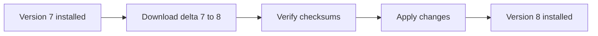
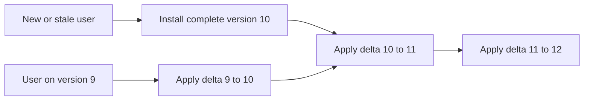
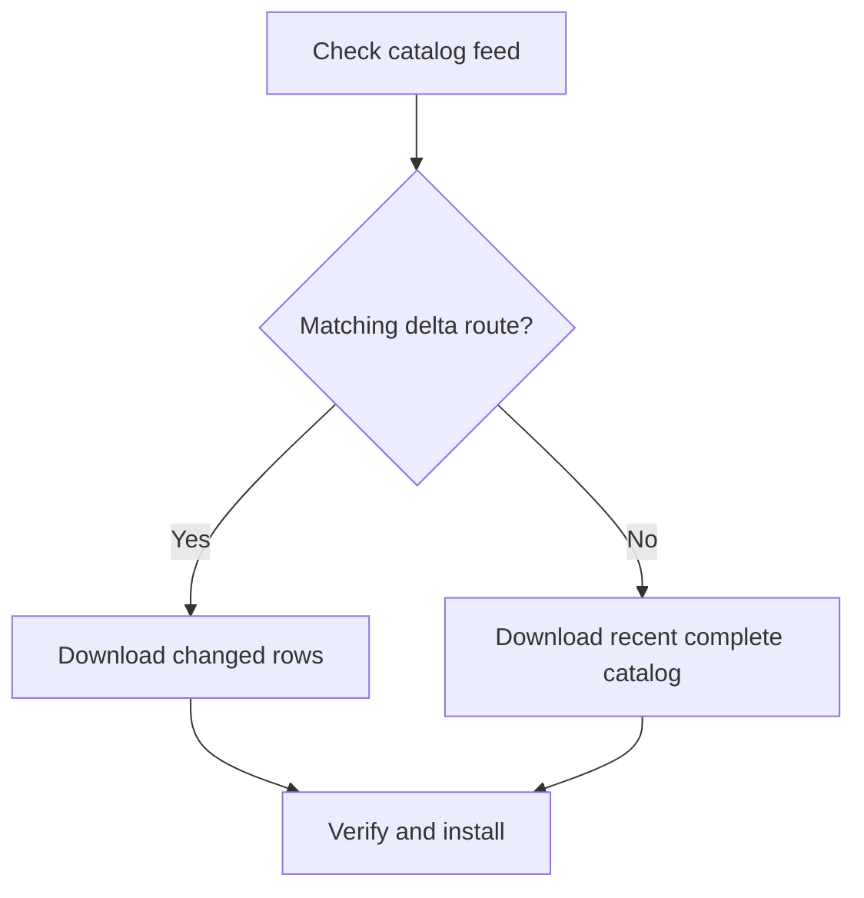

# How CollectorVision Catalog updates work

Catalog v2 is designed to keep routine updates small without making users
manage files or version numbers. CollectorVision chooses the appropriate
download, verifies it, and maintains the local cache.

## Complete catalogs and deltas

A **complete catalog**, or base, contains everything needed to recognize cards
for one game and source.

A **delta** contains only what changed since the immediately preceding version:

- newly added cards;
- removed cards;
- replaced recognition embeddings;
- corrected identifiers;
- changed optional metadata.

The first installation needs a complete catalog. A current installation can
usually advance with a much smaller delta.



## Why deltas require an exact version

A delta is a correction sheet for one specific catalog version. Applying it to
a different version could remove the wrong row or attach an embedding to the
wrong identifier.

CollectorVision therefore applies a delta only when its starting version
exactly matches the installed catalog:

```text
Installed version 7 + delta from 7 to 8 = version 8
Installed version 6 + delta from 7 to 8 = rejected
```

Users do not need to resolve this manually. CollectorVision selects a valid
route or downloads a complete catalog.

## Periodic complete snapshots

Publishing only deltas forever would make a new user download every update since
the catalog began. Catalog v2 periodically publishes another complete snapshot,
normally every tenth change to that individual catalog.

For example, version 10 can provide both:

```text
base/
  embeddings.f16.gz
  identifiers.jsonl.gz
  metadata.jsonl.gz

delta-from-9/
  embeddings.f16.gz
  identifiers.jsonl.gz
  metadata.jsonl.gz
```

This gives users two efficient routes:



The current user keeps taking small updates. The new user starts from a recent
complete catalog instead of replaying the entire history.

## When a full refresh happens

CollectorVision downloads a complete catalog when:

- the game has not been installed before;
- the installed version is too old for the available delta chain;
- a cached file is missing or fails verification;
- the catalog format requires an intentional clean reset.

An occasional complete refresh is expected behavior, not an update failure.



## Metadata updates are optional

Recognition and metadata are separate downloads.

```python
import collector_vision as cv

# Recognition embeddings and identifiers only.
pokemon = cv.CatalogV2("pokemon")

# Recognition plus all available MTG metadata.
mtg = cv.CatalogV2("mtg", include_metadata=True)
```

The Pokémon catalog does not download names, sets, or other display metadata.
Its updates skip metadata too. The MTG catalog downloads metadata and receives
metadata changes alongside recognition updates.

This choice is made independently for every game:

```python
catalogs = {
    "mtg": cv.CatalogV2("mtg", include_metadata=True),
    "pokemon": cv.CatalogV2("pokemon"),
    "lorcana": cv.CatalogV2("lorcana"),
}
```

## Games update independently

Each game and source has its own version sequence:

```text
Scryfall MTG       version 12
TCGplayer Pokémon  version 8
TCGplayer Lorcana  version 5
```

If Pokémon changes this week but MTG and Lorcana do not, only Pokémon receives a
new version. Loading several games does not combine their update histories or
force unrelated downloads.

Scryfall MTG and TCGplayer MTG are also separate catalogs. Applications can use
one or both without coupling their updates.

## Safe installation

Every downloaded file includes its expected byte size and SHA-256 checksum.
CollectorVision verifies files before using them and installs the completed
result atomically.

If a download is interrupted or corrupted, the incomplete result does not
replace the working local catalog. A later online load can retry the update.

## Update schedule

The service checks upstream sources weekly, normally on **Monday at 10:17
UTC**. GitHub Actions may begin slightly after the scheduled time.

A source check does not automatically create a version. A catalog advances only
when its effective recognition data, identifiers, or metadata have changed.
Unchanged games keep their existing version and require no download.

Using `offline=True` skips the online feed check and opens the newest compatible
catalog already installed locally.

## Example update histories

### A regular weekly update

```text
Installed: Pokémon version 8
Available: Pokémon version 9
Download:  delta from 8 to 9
Result:    Pokémon version 9
```

### Returning after several updates

```text
Installed: MTG version 10
Available: MTG version 13
Download:  deltas 10->11, 11->12, and 12->13
Result:    MTG version 13
```

### Returning with an unsupported old version

```text
Installed: Lorcana version 2
Available: Lorcana version 15
Download:  complete version 10, then supported deltas through 15
Result:    Lorcana version 15
```

### Recognition without metadata

```text
Installed: Digimon recognition version 4
Available: Digimon version 5 with recognition and metadata changes
Download:  recognition delta only
Result:    Digimon recognition version 5; no metadata stored
```

The client makes these choices automatically. Applications normally need only
to open the requested game with or without metadata.
